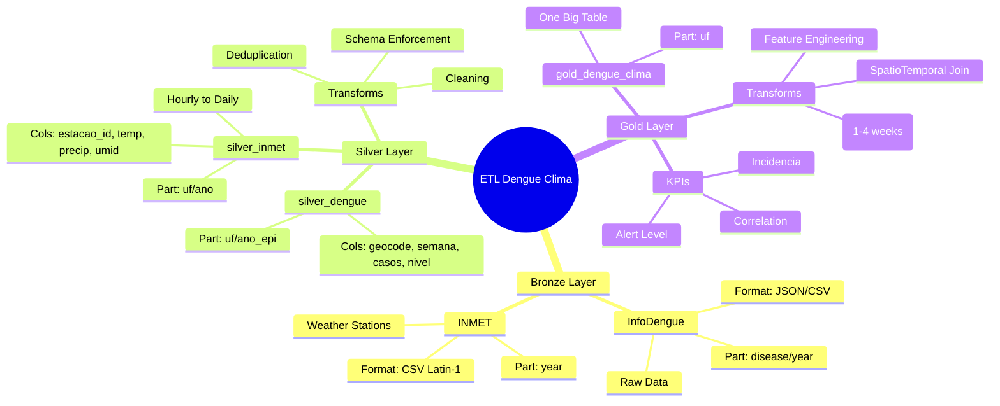
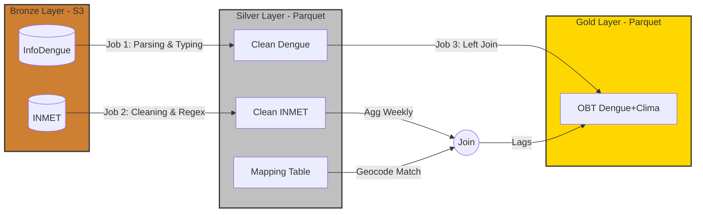

# 🗺️ Mapa Mental e Visualização da Arquitetura

Este documento fornece representações visuais e tabulares do pipeline ETL para facilitar o entendimento rápido do fluxo de dados.

## 🧠 Mapa Mental da Arquitetura (Mermaid)

---

## 🌊 Fluxo de Linhagem de Dados (Data Lineage)

Esta tabela consolida o caminho "De-Para" dos principais campos através das camadas.

| Conceito de Negócio | Campo Bronze (Origem) | Campo Silver (Tratado) | Campo Gold (Analítico) | Transformação Chave |
| :--- | :--- | :--- | :--- | :--- |
| **Localização** | `Localidade_id` / Filename | `geocode` (PK), `uf`, `nome_municipio` | `geocode`, `uf`, `nome_municipio` | Regex de arquivo + Join com tabela IBGE (DTB) |
| **Tempo** | `data_iniSE` | `data_inicio_semana`, `semana_epidemiologica` | `data_inicio_semana`, `semana_epidemiologica` | Parse de Data, Extração de Semana (1-53) |
| **Casos Dengue** | `casos` | `casos_notificados` | `casos_notificados` | Conversão String → Int, Tratamento de Nulos |
| **Estimativa** | `casos_est` | `casos_estimados` | `casos_estimados` | Mantido precisão Double |
| **Alerta** | `nivel` | `nivel_alerta` | `nivel_alerta` | Categorização (1-4) |
| **População** | `pop` | `populacao` | `populacao` | Cópia |
| **Temperatura** | `column07` (INMET) | `temperatura_c` | `inmet_temp_media` | Replace ',' → '.', Agregação Semanal (AVG) |
| **Chuva** | `column02` (INMET) | `precipitacao_mm` | `inmet_precip_tot` | Replace ',' → '.', Agregação Semanal (SUM) |
| **Histórico (Lag)** | - | - | `inmet_temp_media_lag[1-4]` | Window Function (Olhar 1-4 semanas atrás) |

---

## 🔄 Resumo do Processo ETL

