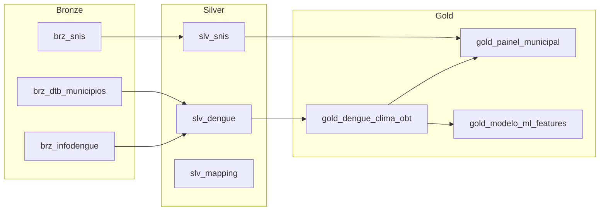

# ETL Sistema Dengue Clima - Dataform

Pipeline ETL completo para transformação de dados de dengue e clima usando Dataform no BigQuery.

## 📁 Estrutura do Projeto

```
src/dataform/
├── dataform.json          # Configuração do projeto
├── package.json           # Dependências
├── README.md              # Esta documentação
│
├── definitions/
│   ├── bronze/            # Declarações de fontes (tabelas raw)
│   │   ├── brz_infodengue.sqlx
│   │   ├── brz_dtb_municipios.sqlx
│   │   └── brz_snis.sqlx
│   │
│   ├── silver/            # Transformações intermediárias
│   │   ├── slv_dengue.sqlx
│   │   ├── slv_snis.sqlx
│   │   └── slv_mapping_estacao_geocode.sqlx
│   │
│   ├── gold/              # Tabelas analíticas finais
│   │   ├── gold_dengue_clima_obt.sqlx
│   │   ├── gold_painel_municipal.sqlx
│   │   └── gold_modelo_ml_features.sqlx
│   │
│   └── assertions/        # Validações de qualidade
│       ├── assert_brz_infodengue_not_empty.sqlx
│       ├── assert_slv_dengue_geocode_valid.sqlx
│       ├── assert_gold_no_negative_cases.sqlx
│       ├── assert_gold_population_positive.sqlx
│       └── assert_ml_features_complete.sqlx
│
└── includes/
    └── constants.js       # Constantes compartilhadas
```

## 🗄️ Datasets BigQuery

| Layer | Dataset ID | Descrição |
|-------|-----------|-----------|
| Bronze | `01_brz_raw_sistema_dengue` | Dados brutos carregados via upload |
| Silver | `02_slv_sistema_dengue` | Dados limpos e tipados |
| Gold | `03_gold_sistema_dengue` | Tabelas analíticas prontas para consumo |
| Assertions | `dataform_assertions` | Resultados das validações |

## 🔄 Fluxo de Dependências



## 🚀 Como Executar

### Pré-requisitos

1. Node.js instalado
2. Dataform CLI instalado: `npm i -g @dataform/cli`
3. Autenticação GCP configurada

### Comandos

```bash
# Navegar para o diretório
cd src/dataform

# Instalar dependências
npm install

# Compilar (validar sintaxe)
dataform compile

# Executar dry-run (mostra o que seria executado)
dataform run --dry-run

# Executar pipeline completo
dataform run

# Executar apenas Gold layer
dataform run --tags gold

# Executar apenas assertions
dataform run --tags data-quality
```

## 📊 Tabelas Principais

### gold_dengue_clima_obt

Tabela principal (OBT) com casos de dengue e features de clima para ML.

**Colunas Principais:**

- `geocode`: Código IBGE do município
- `casos_notificados`: Casos na semana
- `casos_lag1` a `casos_lag4`: Casos das semanas anteriores
- `temp_media_lag1` a `temp_media_lag4`: Temperatura das semanas anteriores
- `incidencia_100k`: Incidência por 100 mil habitantes

### gold_painel_municipal

Dados agregados para dashboards.

### gold_modelo_ml_features

Features prontas para treinamento de modelos ML.

## ✅ Assertions (Validações)

| Assertion | Descrição |
|-----------|-----------|
| `assert_brz_infodengue_not_empty` | Garante que a fonte Bronze tem dados |
| `assert_slv_dengue_geocode_valid` | Valida formato do geocode (7 dígitos) |
| `assert_gold_no_negative_cases` | Casos não podem ser negativos |
| `assert_gold_population_positive` | População deve ser > 0 |
| `assert_ml_features_complete` | Features de ML não podem ter nulls |

## 🔧 Manutenção

### Adicionar Nova Fonte Bronze

1. Criar arquivo em `definitions/bronze/brz_nova_fonte.sqlx`
2. Usar `type: "declaration"` com database/schema/name

### Adicionar Nova Transformação Silver

1. Criar arquivo em `definitions/silver/slv_nova_tabela.sqlx`
2. Usar `type: "table"` e referenciar fontes com `${ref("brz_...")}`

### Adicionar Nova Assertion

1. Criar arquivo em `definitions/assertions/assert_regra.sqlx`
2. Usar `type: "assertion"` e retornar linhas que violam a regra
